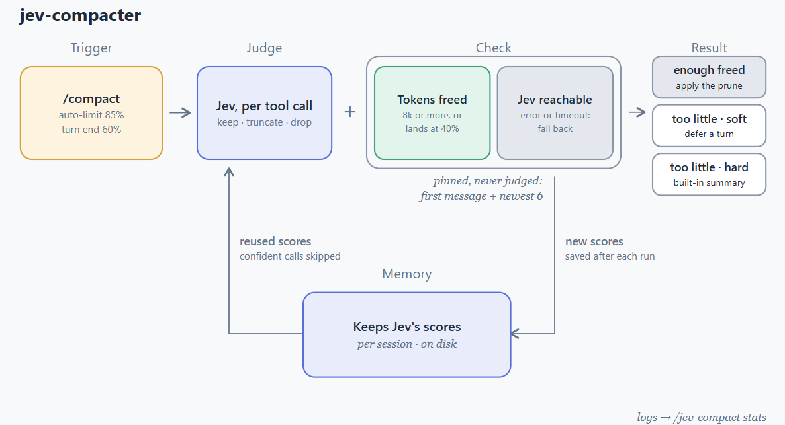
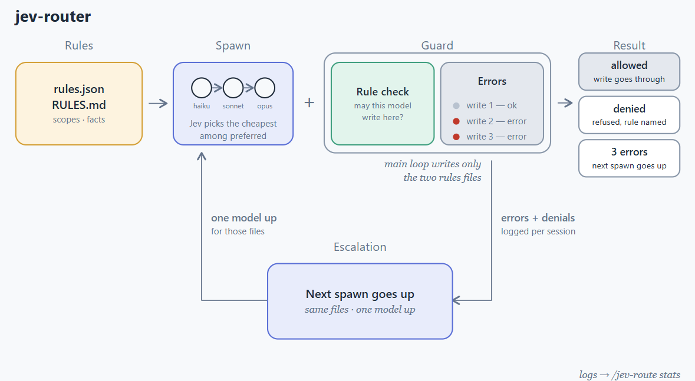
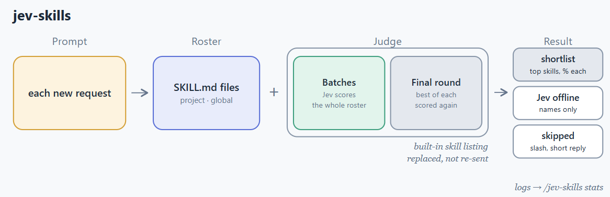

<div align="center">

# optim-jev

**Spend fewer tokens in long Claude Code sessions—without changing how you work.**

Jev-powered context compaction, model routing, and skill selection in one Claude Code plugin.

[](https://code.claude.com/docs/en/overview)
[](https://www.python.org/downloads/)
[](https://github.com/Oqura-ai/optim-jev/stargazers)
[](https://github.com/Oqura-ai/optim-jev/forks)
[](https://github.com/Oqura-ai/optim-jev/issues)
[](#license)
[](https://discord.gg/EpUxGjNBva)

[Get started](#quick-start) · [Documentation](docs/README.md) · [Architecture](docs/architecture.md) · [Contributing](docs/contributing.md)


</div>

## Why optim-jev?

Long agent sessions accumulate stale tool output, send oversized skill catalogs, and use the main model for work a smaller model could handle. optim-jev reduces that overhead at three points while keeping Claude Code's normal workflow intact.

Each tool works independently, fails open if unavailable, and includes a `stats` command that reports session-level cost and savings in US dollars.

## Three tools, one plugin

| Tool | What it does | Default | Learn more |
|---|---|:---:|---|
| **jev-compacter** | Removes stale tool calls and outputs instead of summarizing away the whole conversation | On | [Guide](docs/jev-compacter.md) |
| **jev-router** | Routes file changes to the right model using project-specific rules that evolve with your workflow | Off | [Guide](docs/jev-router.md) |
| **jev-skills** | Sends a short, relevant skill list for each prompt instead of the entire catalog | Off | [Guide](docs/jev-skills.md) |

<details>
<summary><strong>jev-compacter — preserve useful context</strong></summary>

<br>


It works automatically with `/compact` and auto-compaction. Inspect the current session with:

```text
/jev-compact stats
```

</details>

<details>
<summary><strong>jev-router — use the right model for each edit</strong></summary>

<br>


```text
/jev-route init "what matters in this project"
/jev-route on | off
/jev-route why | stats
```

Tell Claude to change a preference later—for example, “let haiku edit the tests”—and the project rules update with your workflow.

</details>

<details>
<summary><strong>jev-skills — load only relevant skills</strong></summary>

<br>


```text
/jev-skills on | off
/jev-skills scope project | global
/jev-skills why | stats | reindex
```

</details>

## Quick start

### Requirements

- [Claude Code](https://code.claude.com/docs/en/overview) with plugin support
- Python 3.10 or newer
- A TypeSafe API key for Jev

### Install

```bash
git clone https://github.com/Oqura-ai/optim-jev.git
claude plugin marketplace add ./optim-jev
claude plugin install optim-jev@optim-jev
```

Set the key in Claude Code under `/config` → **TypeSafe API key**, or export it before starting Claude Code:

```bash
export TYPESAFE_API_KEY="your-key"
```

Restart Claude Code. jev-compacter is ready immediately; enable the router and skill picker when you want them. See [Getting started](docs/getting-started.md) for every command, option, and troubleshooting step.

> [!NOTE]
> The plugin uses only Python's standard library. Your API key is passed to child processes through the environment and is never written to project files or logs.

## Documentation

| Resource | What you will find |
|---|---|
| [Getting started](docs/getting-started.md) | Installation, configuration, commands, and troubleshooting |
| [Performance metrics](docs/performance-metrics.md) | How token usage, cost, and estimated savings are calculated |
| [Architecture](docs/architecture.md) | The TypeScript-to-Python bridge, data flow, and session logs |
| [Contributing](docs/contributing.md) | Local setup, tests, conventions, and pull requests |

## Community and support

- Found a bug or have a feature idea? [Open an issue](https://github.com/Oqura-ai/optim-jev/issues/new/choose).
- Want to help? Read the [contributing guide](docs/contributing.md) and submit a focused pull request.
- For the wider Claude Code community, join the official [Claude Developers Discord](https://anthropic.com/discord).

## License

optim-jev is released under the MIT License.

<div align="center">

Built by [Oqura.ai](https://github.com/Oqura-ai) for more efficient Claude Code workflows.

</div>
