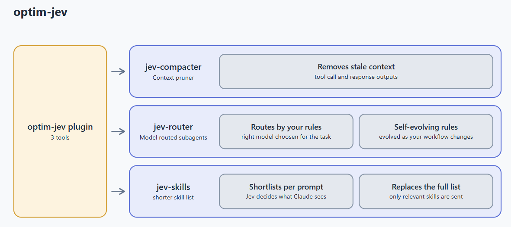

# Architecture



optim-jev is one Claude Code plugin holding three independent tools. Each can be switched on or off on its own, and they share only the plumbing described here.

## Two halves

```
 Claude Code process                          Python child process, one per call
 ───────────────────                          ──────────────────────────────────
 hooks/optim-jev.ts  ── JSON on stdin  ──►    python -m optim_jev.tools.<tool>.tool <mode>
   (hook functions)  ◄── JSON on stdout ──        all decisions, file I/O, Jev calls
                                                         │
                                                         └── HTTPS ──► Jev API
```

- **TypeScript** ([`hooks/optim-jev.ts`](../hooks/optim-jev.ts), [`hooks/router-lib.ts`](../hooks/router-lib.ts), [`hooks/dashboard.tsx`](../hooks/dashboard.tsx)) runs inside Claude Code. It is the only part that can see the live conversation, change it, block a tool call or pick a subagent's model. It holds as little logic as possible: it gathers facts, runs Python, and applies the answer. The dashboard reads that in-memory snapshot and does not call Python.
- **Python** ([`src/optim_jev/`](../src/optim_jev/)) holds the logic. It starts fresh on every call, so anything that must survive between calls is written to `.optim-jev/`.

Every Python call is the same shape:

```
python -m optim_jev.tools.jev_router.tool spawn
  stdin : {"session_id": "...", "project_dir": "...", "options": {...}, ...mode fields}
  stdout: {...answer}
```

- `PYTHONPATH` is set to the plugin's `src/`, and the API key travels as the `TYPESAFE_API_KEY` environment variable, never in stdin.
- A non-zero exit becomes an error in the hook, carrying the last 3 lines of stderr. Each hook decides its own fallback (usually: do what Claude Code would have done without the plugin).
- Options reach Python as the plugin's `userConfig`; each tool reads only keys with its own prefix (`jev_compacter_`, `jev_router_`, `jev_skills_`).

## Loading

| File | Role |
|---|---|
| [`.claude-plugin/plugin.json`](../.claude-plugin/plugin.json) | name, version, and every user option |
| [`.claude-plugin/marketplace.json`](../.claude-plugin/marketplace.json) | lets the repo be added as a marketplace |
| [`hooks/hooks.json`](../hooks/hooks.json) | `{"modules": ["./optim-jev.ts"]}`: names the hooks module |
| [`hooks/optim-jev.ts`](../hooks/optim-jev.ts) | `register()` runs on every load or reload and subscribes all hooks |
| [`hooks/dashboard.tsx`](../hooks/dashboard.tsx) | pure formatting and rendering for the three-tool dashboard |
| `.claude-plugin/types/` | editor types, regenerated by Claude Code on load |

## Hooks used

| Event | Used by | For |
|---|---|---|
| `session.start` | all | register commands, restore per-session modes, build the skill index |
| `command.run` | all | `/jev-compact`, `/jev-route`, `/jev-skills` |
| `session.compact` | compacter | replace the built-in summary with a Jev prune |
| `turn.complete` | all | auto-compaction check, router outcome, usage log flush |
| `turn.start` | router | reset per-turn counters |
| `turn.step` | router | apply each routed subagent's effort to its requests |
| `prompt.compose` | router | add the routing instructions to the system prompt |
| `prompt.submit` | skills | attach the shortlist to the prompt |
| `prompt.attachment` | skills | replace the built-in skill listing |
| `tool.call` | router | guard writes, count errors, re-check edited rules |
| `tool.check` | skills | allow reading skill folders in global scope |
| `agent.spawn` | router | pick the subagent's model and effort, extend its prompt |
| `skill.prompt` | skills | log which skills were actually loaded |
| `ui.render` (`AbovePrompt`) | all | render live state and controls without doing I/O |

`session.start` and `turn.complete` are shared: one handler each, calling into every tool in turn.

## Source layout

```
src/optim_jev/
├── core/
│   ├── paths.py      the project's .optim-jev/ folder
│   ├── logs.py       per-session JSONL logs; `python -m optim_jev.core.logs claude` writes Claude usage
│   └── pricing.py    prices and the readers every stats command shares
└── tools/
    ├── jev_compacter/   see jev-compacter.md
    ├── jev_router/      see jev-router.md
    └── jev_skills/      see jev-skills.md
```

Each tool has a `tool.py` entry point with a `HANDLERS` table of modes, and a `config.py` with its defaults. The Jev HTTP client lives in [`jev_compacter/jev.py`](../src/optim_jev/tools/jev_compacter/jev.py) and is shared by all three.

## Data on disk

Everything is under `<project>/.optim-jev/`. Nothing is written to `~/.claude/`.

```
.optim-jev/
├── .gitignore            ignores everything except the two router files below
├── jev_router/
│   ├── rules.json        shared: which models may write where     (commit it)
│   ├── RULES.md          shared: facts about the codebase         (commit it)
│   └── models.json       local: which models this account can use
├── jev_skills/
│   └── index.json        local: cached skill index
└── logs/                 local: one JSONL file per session per tool
    ├── claude/
    ├── jev_compacter/
    ├── jev_router/
    └── jev_skills/
```

### Session logs

Each line is one JSON record with a `ts` and a `kind`. Files are appended to, never rewritten, so a killed process can at worst leave one cut line, which readers skip.

| File | Kinds |
|---|---|
| `claude/<session>.jsonl` | `turn` (Claude's 4 token counts per turn, main loop or subagent), `summary` (a built-in summary's usage), `spawned` (links a subagent id to its routed model), `init` |
| `jev_compacter/<session>.jsonl` | memory snapshots (`schema` field; the last one is the live memory) and `compaction` outcomes |
| `jev_router/<session>.jsonl` | `spawn` and `outcome` |
| `jev_skills/<session>.jsonl` | `shortlist` and `loaded` |

Every record that called Jev carries a `jev` block: requests, input and output tokens, the price used and `cost_usd`. These logs feed the [stats commands](performance-metrics.md).

Claude usage records are collected in memory during a turn and written in one call when the main-loop turn ends, because hooks can't append to files directly.

## Design rules

- **Fail open.** Any Python error falls back to what Claude Code would have done anyway (built-in summary, session model, full skill list). The plugin should never block work.
- **Stateless Python.** Every call re-reads what it needs from disk.
- **Static prompt text.** Anything added to the system prompt stays the same across turns, so the prompt cache keeps working.
- **Session-scoped logs.** Stats never mix sessions.
